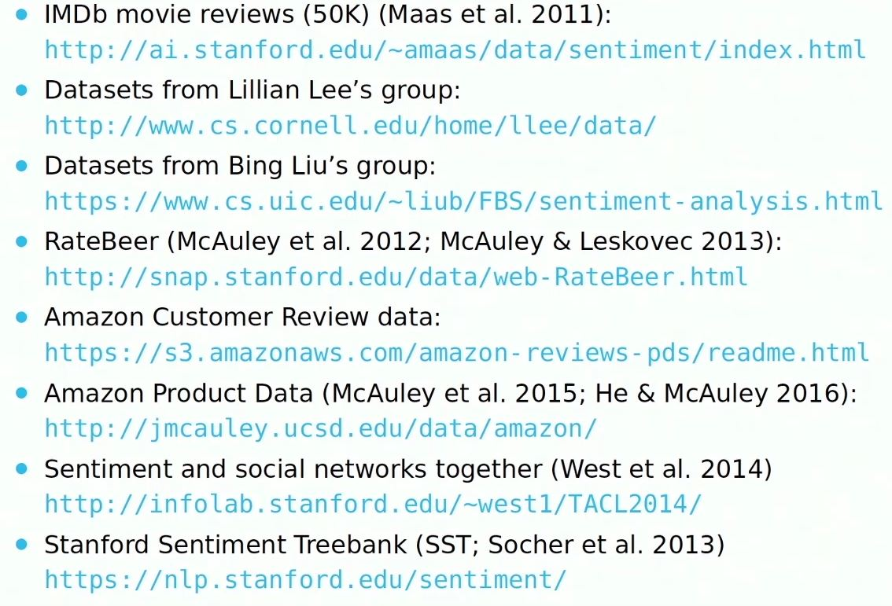
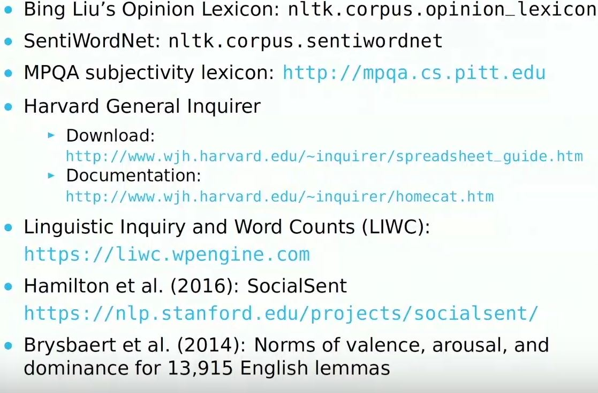

#### [Sentiment Analysis](https://github.com/A2Amir/Sentiment-Analysis/blob/master/Sentiment%20Analysis.ipynb) with logistic Regression and Fully Connected layer and LSTM (Tensorflow 1)

I am going to looking at how to apply Logistic Regression to the task of sentiment analysis. Sentiment analysis can be thought of as the exercise of taking a sentence, paragraph, document, or any piece of natural language, and determining whether that text is emotional tone is positive or negative. 

Data Preprocessing

Some steps are necessary to prepare our dataset

         1-Tokenizing, it is when you convert words into numbers-->[“The”, “cat”, “went”, “to”, “the”, “zoo”, “.”] it would be              tokenized to [1, 2, 3, 4, 1, 5, 6]. it  is done by Keeras

        2-The next step is to make all of the reviews the same length.------> max_review_length = 70

        3-Convert all labels into One Hot Encoding 

        3-For Logistic Regression must all comment be transformed in tensor(Array).

Logistic Regression model
We now define our operations in order to properly run the Logistic Regression. Logistic regression is typically thought of as a single equation:

              ŷ=sigmoid(WX+b)

              
However, for the sake of clarity, we can have it broken into its three main components: 

              a weight times features matrix multiplication operation, 
              a summation of the weighted features and a bias term, 
              and finally the application of a sigmoid function. 

Deep Learning Approches

In this section, I will predict the sentiment of movie reviews as either positive or negative in Python using the Keras deep learning library. 

              1-Fully connected Layers
              2-LSTM layers with Word Embeding.
Sentiment Analysis Datasets:

Sentiment Lexica:

there are a lot of sentiment lexica that can are very useful resources which can be used for problems related to the sentiment analysis:

